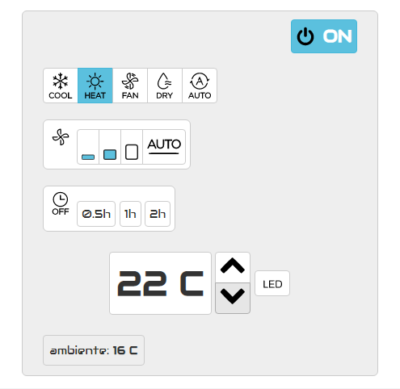

# ACWebControl
Air Conditioning web control for BGH BSI35WCGT, remote control RG10A(E2S)/BGEF.
Server running on [ESP8266](https://github.com/NicoThien/IRremoteESP8266/blob/master/examples/Web-AC-control/Web-AC-control.ino).

On/off , mode, fan flow and temperature control. Ambient temperature sensor DS18B20.
Responsive interface.

